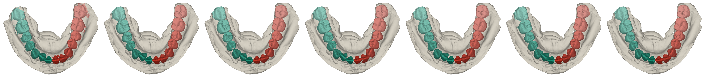

# 3D Comparison Maker

Compare multiple 3D models at once. Supports PLY, STL, OBJ, XYZ, and GLTF/GLB models.

> Developed with Tauri + Next.js + three.js

Prepare the candidate models, and perform the render.

### Features

- Customize the rendering effect
- Render multiple models at once
- Customize the candidates' rendering order
- Output Hi-Res images
- Persistence of settings for reproducibility
